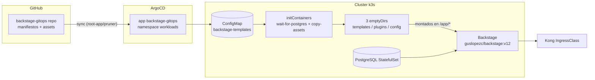

# Backstage GitOps Repository

Manifiestos gestionados por Argo CD para el **portal de desarrollador Backstage** del
cluster k3s. Este repositorio es la **fuente de verdad de la plataforma Backstage**:
configuración de arranque, templates de software, plugins personalizados, catálogo,
PostgreSQL y políticas de red.

## Ecosistema

<p>
   Backstage &nbsp;
   ArgoCD &nbsp;
   Kubernetes &nbsp;
   PostgreSQL &nbsp;
   Kong &nbsp;
   cert-manager &nbsp;
   GitHub
</p>

## Arquitectura en una imagen



**Idea central**: el deployment es **100 % estático**. No hay `subPath` ni ficheros
generados en la imagen de Backstage: todos los ficheros que Backstage necesita
(templates, plugins, `override.yaml`) viven en el **ConfigMap `backstage-templates`**,
y un initContainer `copy-assets` los materializa como ficheros reales en tres
`emptyDir` que se montan en `/app/templates`, `/app/plugins` y `/app/config`.

> ⚠️ **Por qué 3 emptyDir** (lección importante): un único `emptyDir` montado en varias
> rutas muestra la **raíz completa del volumen en todos los mounts** (`readdir` ve
> `templates/`, `plugins/`, `override.yaml` en cada uno). El enrutado por prefijo a tres
> emptyDir separados fue el arreglo.

## Estructura

```
apps/
├── kustomization.yaml          # entrada del arquetipo (destino: workloads)
└── backstage/
    ├── kustomization.yaml      # recursos del app Backstage
    ├── deployment.yaml         # Deployment: initContainers + 3 emptyDirs + mounts fijos
    ├── service.yaml            # ClusterIP 7007
    ├── ingress.yaml            # Kong, host backstage.local, TLS (backstage-tls)
    ├── certificate.yaml        # certificado cert-manager
    ├── k8s-rbac.yaml           # ServiceAccount + ClusterRole + Binding
    ├── composition.yaml        # XLocalDeployment (Crossplane, pipeline patch-and-transform)
    ├── assets/                 # FUENTE ÚNICA de contenido de Backstage
    │   ├── override.yaml       #   merge de config de arranque (catalog, integrations…)
    │   ├── plugins/            #   custom-actions.cjs.js (acciones scaffolder)
    │   └── templates/          #   python-fastapi, go-frontend, k8s-manifests
    │       └── <template>/     #   template.yaml + skeleton/
    ├── templates/configmap.yaml   # ConfigMap backstage-templates (GENERADO, no editar)
    ├── postgres/               # StatefulSet + Service + secret (PG)
    └── network-policies/       # allow-backstage-* / allow-postgres-ingress (zero trust)
```

## Cómo se genera el ConfigMap

`assets/` es la fuente única. El CM se regenera con el script:

```bash
python3 /tmp/opencode/gen_cm.py /tmp/backstage-gitops
```

- Cada fichero de `assets/` se vuelve una clave del CM con los `/` codificados como `.`
  (ej. `templates/go-frontend/template.yaml` → `templates.go-frontend.template.yaml`).
- Se añade la clave `layout` (líneas `clave-dot ruta`) que el initContainer `copy-assets`
  lee para repartir cada fichero a su emptyDir según el prefijo.
- ⚠️ **`templates/configmap.yaml` es un fichero generado**: nunca se edita a mano.

Cambios en un template/override → regenerar CM → PR/push → Argo sync → `rollout restart`.

## Bootstrap / ciclo

1. Argo CD instala `app backstage-gitops` leyendo `apps/` de este repo.
2. El rollback/update viaja por Git: `git push` → sync automático de Argo → rollout.
3. El contenido del portal (templates, plugins, catálogo) viaja por el ConfigMap + `copy-assets`.

## Operación

- Sync de Argo: app `backstage-gitops` (namespace `workloads`).
- Reiniciar el pod tras cambiar el CM: `kubectl -n workloads rollout restart deploy/backstage`.
- Portal: `https://backstage.local` (añade en tu `/etc/hosts`: `192.168.100.77 backstage.local`).

## Documentación completa

| Doc | Contenido |
|---|---|
| [`docs/index.md`](docs/index.md) | Mapa de documentación y repos correlacionados |
| [`docs/proceso.md`](docs/proceso.md) | **Ciclo de vida completo** de un workload (alta → deploy → baja) |
| [`docs/arquitectura.md`](docs/arquitectura.md) | Arquitectura del deployment, CM, initContainers, red, TLS, RBAC |
| [`docs/templates.md`](docs/templates.md) | Las 3 templates de software (inputs, pasos, skeletons) |
| [`docs/configuracion.md`](docs/configuracion.md) | override.yaml, secretos, merge de config de Backstage |
| [`docs/catalogo.md`](docs/catalogo.md) | Catálogo: locations, registro, owner, limpieza |
| [`docs/operacion.md`](docs/operacion.md) | Tareas del día a día + lecciones aprendidas |

---

> **Repos relacionados**: [`control-plane`](https://github.com/gusLopezC-DevOps/control-plane)
> (App-of-Apps + gancho de alta de workloads),
> [`backstage-workloads`](https://github.com/gusLopezC-DevOps/backstage-workloads)
> (entidades estáticas de catálogo),
> workload de ejemplo: `go-frontend-test`.