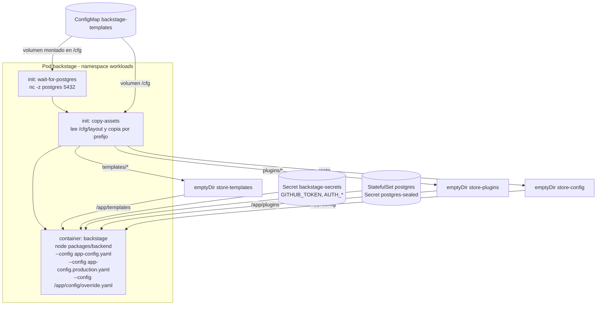
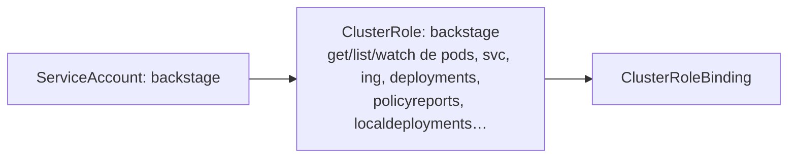

# Arquitectura del deployment de Backstage

Cómo se monta Backstage dentro del cluster (k3s single-node), con énfasis en el
modelo de **ConfigMap único + initContainers + emptyDir** y en la configuración
de red, TLS y RBAC.

## Vista por contenedores y volúmenes



### InitContainers

| Init | Imagen | Qué hace |
|---|---|---|
| `wait-for-postgres` | `busybox:1.36` | Espera a que `postgres` responda en `5432` antes de arrancar Backstage. |
| `copy-assets` | `busybox:1.36` | Lee `/cfg/layout` (listado `clave-dot ruta`), y por cada línea copia `"/cfg/$key"` a `/store-templates`, `/store-plugins` o `/store-config` según el prefijo de `ruta` (`templates/*`, `plugins/*`, resto). |

### Los 3 emptyDir

| EmptyDir | Se monta en el pod en | Contenido |
|---|---|---|
| `store-templates` | `/app/templates` | `templates/…` del CM |
| `store-plugins` | `/app/plugins` | `plugins/…` del CM |
| `store-config` | `/app/config` | `override.yaml` y resto de claves |

**Por qué 3 y no 1**: un emptyDir montado en varias rutas expone la raíz completa del
volumen en todos los mounts (el `readdir` ve todo en cada punto de montaje). Al separar
por prefijo en tres emptyDir distintos, Backstage solo ve ficheros reales en cada ruta.

### ConfigMap `backstage-templates` (CM)

- Se genera desde `assets/` con `gen_cm.py` (ver `README.md` del repo).
- Claves: ficheros con los `/` → `.` (ej. `plugins/custom-actions.cjs.js`)
  + clave `layout` con la tabla de reparto.
- Volumen `backstage-templates` (configMap, `defaultMode: 420`) en `/cfg`.

## Configuración de arranque (args)

```
node packages/backend \
  --config app-config.yaml \
  --config app-config.production.yaml \
  --config /app/config/override.yaml
```

El `override.yaml` (que viaja en el CM) es el único merge de configuración que
gestionamos; los dos `app-config*.yaml` vienen de la imagen. La imagen se construye
desde el repo [gitops `gusLopezC-DevOps/backstage-app`](https://github.com/gusLopezC-DevOps/backstage-app)
(CI `build-push`): es **runtime puro** + python/mkdocs para TechDocs, y hornea solo
`catalog/entities/{users,groups}.yaml` (montados en `/app/entities`). **No hornea
templates**: las 3 plantillas y la action custom (`gitops:push-to-repo`) viven en el
CM y se montan en `/app/templates` y `/app/plugins`.

> **Regla de oro de Backstage (merge)**: un cambio sobre una clave con formato
> **array reemplaza el array completo** (no lo concatena). Por eso el catálogo se
> define entero en el `override.yaml` y no se confía en que se "sume" al de la imagen.

## Secretos

| Secret (cluster) | Contenido | Uso |
|---|---|---|
| `backstage-secrets` | `GITHUB_TOKEN`, `AUTH_GITHUB_CLIENT_ID/SECRET` | env del Deployment (integraciones GitHub + OAuth) |
| `postgres-sealed` | `POSTGRES_USER`, `POSTGRES_PASSWORD` | env de Backstage para la BD |

- Los secretos viven en el cluster como **SealedSecrets** (policy de
  `control-plane/docs/gestion-secretos-lite.md`); no se versionan en claro en Git.
- `integrations.github.token: ${GITHUB_TOKEN}` se resuelve del env del pod y permite
  a Backstage leer repos **privados** y hacer `raw.githubusercontent.com`.

## Servicio, Ingress y TLS

```yaml
# ingress.yaml (resumen)
ingressClassName: kong
tls:
  - hosts: [backstage.local]
    secretName: backstage-tls
rules:
  - host: backstage.local
    http:
      paths:
        - path: /        pathType: Prefix
          backend:  service.backstage :7007
```

- `service.yaml`: ClusterIP en puerto `7007`.
- TLS: cert-manager emite/clasifica `backstage-tls`; Kong presenta el certificado.
- **DNS**: el nodo resuelve los `.local` por `/etc/hosts` del nodo
  (`192.168.100.77 backstage.local …`). Los clientes deben añadir la línea a su propio
  `/etc/hosts`.

## RBAC

`k8s-rbac.yaml`:



- El SA que usa el pod Backstage (para el plugin de Kubernetes y el custom resource
  `wgpolicyk8s.io/policyreports` / `example.crossplane.io/localdeployments`, definidos
  en `override.yaml` → `kubernetes.customResources`).

## Network policies (zero trust)

| Policy | Efecto |
|---|---|
| `allow-backstage-ingress` | Solo Kong → Backstage :7007 |
| `allow-backstage-egress` | Egress de Backstage (GitHub, BD, cluster API) |
| `allow-postgres-ingress` | Solo Backstage → PostgreSQL :5432 |

## PostgreSQL

`postgres/` (StatefulSet + Service `postgres` + Secret):

- Estado local: PVC `local-path` (hostPath en el nodo).
- El catálogo vive en la BD `backstage_plugin_catalog`; inspección con
  `kubectl -n workloads exec postgres-0 -- psql …` (ver `operacion.md`).

## Crossplane (template k8s-manifests)

`composition.yaml` define `XLocalDeployment` (pipeline `patch-and-transform`) para
desplegar Deployment + Service + Ingress desde un `LocalDeployment` claim
(arquetipo usado por el template `k8s-manifests`).

## Tema "Kong + certificado"

- Los ingress usan `ingressClassName: kong`; el controller es `kong-kong-proxy`
  (LoadBalancer `192.168.100.77`, 80/443).
- El certificado default que presenta Kong es genérico (`CN=localhost`, sin SAN):
  el navegador avisa pero no bloquea; cada workload con TLS propio usa su Secret.