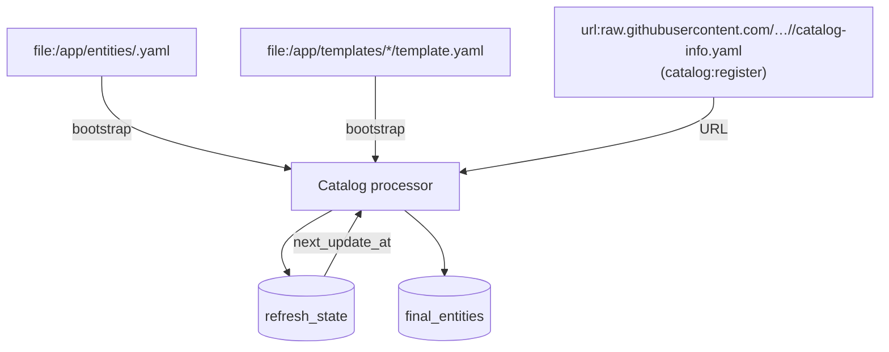

# Catálogo Backstage: locations, registro y limpieza

Cómo Backstage descubre, registra y mantiene las entidades del catálogo (Componentes,
Groups, Templates, Systems, Resources).



## Tipos de location

| Tipo | Ejemplo | Propósito | Config |
|---|---|---|---|
| `file` | `/app/entities/users.yaml` | Entidades de imagen (user, group) | `catalog.locations` en `override.yaml` |
| `url` (raw) | `https://raw.githubusercontent.com/…/catalog-info.yaml` | Componentes de repos | `catalog:register` en los templates |
| `url` (blob) | `https://github.com/…/catalog-info.yaml` | Entidades de `backstage-workloads` | `catalog:register` (k8s-manifests) |
| `bootstrap` | interna | Arranque inicial de los `file:` | interna |

> **Diferencia raw vs blob**: el refresh processor usa `raw` como URL estable
> (el `tree`/`blob` puede cambiar de estructura). La variante `raw` se usa
> también para `catalogInfoUrl` vía API; `blob` / `repoContentsUrl` + path
> funciona solo para locations HTTP directas (no headless register).

## Owner por defecto y grupo `development`

- Los templates (python, go) declaran `owner: group:default/development` y
  `grupo` con default `development`.
- La entidad `group:default/development` (y `user:default/guslopezc`) viven en
  `backstage-entities` y se cargan desde el archivo de imagen
  `/app/entities/groups.yaml` / `/app/entities/users.yaml`.
- **Si una entidad dice `owner: group:default/<g>` y ese grupo no existe**:
  la UI muestra la advertencia *"Entities not found are: group:default/<g>"*
  y la entidad no aparece en **Owned Components** del usuario.
  → Solución: o añadir la entidad Group o cambiar el owner a `development`.

## Cuándo aparece un componente en "Owned Components"

1. El componente tiene `owner: group:default/<g>`.
2. El usuario miembro del `Group <g>` (via `group.yaml` → `relations` de miembro).
3. `refresh_state.errors = []` (procesado correctamente).

## Registro headless vs UI

El registro vía API (`POST /api/catalog/locations`) requiere OAuth (sesión de
navegador) y falla desde CLI (401 `Missing credentials`) con nuestro `app-config`
actual. El registro con `catalog:register` de los templates funciona porque usa
un URL raw resuelto internamente (con el token de la integración GitHub).

## Limpieza de entidades obsoletas

Cuando un repositorio se borra, la Location apunta a un 404 y la entidad queda
"stale". Para evitar churn y errores de refresh, borrar desde la BD:

```bash
# 1. borrar la Location (cascada: refresh_state_references)
psql -c "DELETE FROM locations WHERE target LIKE '%<nombre>%';"

# 2. borrar la entidad (cascada: final_entities, relations)
psql -c "DELETE FROM refresh_state WHERE entity_ref='component:default/<nombre>';"
```

> Para entidades de `file` (vienen de `components.yaml`), borrar la location
> desde la configuración (`override.yaml` → `catalog.locations`) antes de borrar
> la entidad, para que no vuelva a procesarse.

## Caso de estudio: go-frontend-test

1. Template crea repo → `catalog:register` → location raw → componente registrado
   con `owner: group:default/development` → visible en **Owned Components**.
2. Si el owner fuera `dev` (grupo inexistente): no aparece en Owned + warning.
3. `repoVisibility: public` porque el token de org no llega a repos privados
   y los secretos no van en el workload.

## Datos del catálogo (cluster)

- BD: `backstage_plugin_catalog` (PostgreSQL `postgres`).
- Query de soporte rápido:

```bash
kubectl -n workloads exec postgres-0 -- psql -U postgres -d backstage_plugin_catalog -c "
  SELECT entity_ref, errors FROM refresh_state WHERE entity_ref LIKE 'component:%';
"
```