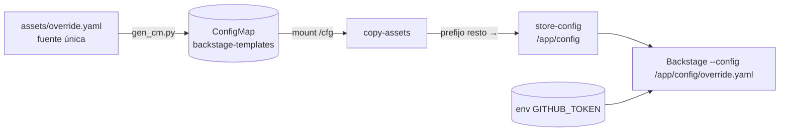

# Configuración: override.yaml, CM y secretos

Todo lo que Backstage necesita además de su imagen arranca del **ConfigMap
`backstage-templates`** y, en concreto, del fichero `override.yaml`.



## `override.yaml` — bloques

| Bloque | Propósito |
|---|---|
| `integrations.github` | Token `${GITHUB_TOKEN}` → repos privados + raw GitHub |
| `catalog.locations` | Entidades locales (`/app/entities/{users,groups}.yaml`) y los 3 templates (`file:`) |
| `kubernetes.customResources` | Modelos extra del plugin Kubernetes (`policyreports` kyverno, `localdeployments` crossplane) |
| `kyverno.enablePermissions` | `false` (no exponer permisos hacia afuera) |
| `kubernetesResources.enablePermissions` | `true` + `annotationPrefix: terasky.backstage.io` + concurrency |

> **Nota**: el catálogo actual ya **no** carga `components.yaml` (demos/entidades
> antiguas) — se quitó esa location al limpiar el catálogo (ver `catalogo.md`).

### Lección crítica: el merge de Backstage reemplaza arrays

Backstage hace merge de `app-config*.yaml` + override. Si una clave es un
**array** (p.ej. `catalog.locations`, `integrations.github`), el último fichero
**reemplaza** el array completo — no lo concatena ni hace merge profundo de objetos.

Consecuencias en la práctica:

1. El `override.yaml` debe declarar **todo** el catálogo propio; lo que ponga la
   imagen en la misma clave queda fuera.
2. `integrations.github` va con `- host: github.com\n token: ${GITHUB_TOKEN}`
   (array de un solo elemento) y convive con el env del pod.

## Secreto del pod (env) → integración

| env | Fuente (Secret) | Uso |
|---|---|---|
| `GITHUB_TOKEN` | `backstage-secrets` | integración GitHub (`integrations.github.token`) |
| `AUTH_GITHUB_CLIENT_ID` | `backstage-secrets` | OAuth (login de usuario en la UI) |
| `AUTH_GITHUB_CLIENT_SECRET` | `backstage-secrets` | OAuth |
| `POSTGRES_USER` / `POSTGRES_PASSWORD` | `postgres-sealed` | conexión a BD |
| `POSTGRES_HOST` | lit. `postgres.workloads.svc.cluster.local` | arranque |

Estrategia de secretos: **SealedSecrets** (ver `control-plane/docs/gestion-secretos-lite.md`);
nunca en claro en Git.

## Mapa del CM (layout)

El `layout` del CM lista cada fichero con su clave `.`-codificada y su destino:

```
override.yaml override.yaml
plugins.custom-actions.cjs.js plugins/custom-actions.cjs.js
templates.python-fastapi.template.yaml templates/python-fastapi/template.yaml
templates.go-frontend.template.yaml templates/go-frontend/template.yaml
templates.go-frontend.skeleton.main.go templates/go-frontend/skeleton/main.go
…
```

El initContainer lee esta tabla y copia cada clave al emptyDir correcto
(`templates/*`→store-templates, `plugins/*`→store-plugins, resto→store-config).

## Regenerar y desplegar un cambio de config

```bash
# 1. editar assets/…
python3 /tmp/opencode/gen_cm.py /tmp/backstage-gitops

# 2. commit + push
git -C /tmp/backstage-gitops add -A
git -C /tmp/backstage-gitops commit -m "config: <cambio>"
git -C /tmp/backstage-gitops push

# 3. argo force-sync + rollout
kubectl -n workloads rollout restart deploy/backstage

# 4. comprobar
kubectl -n workloads exec deploy/backstage -- cat /app/config/override.yaml
```

> ⚠️ tras un cambio de CM, verificar siempre que el pod arranca con el **contenido
> nuevo** (a veces el sync de Argo y el rollout se pisan). Si coje la versión vieja,
> reintentar el rollout.