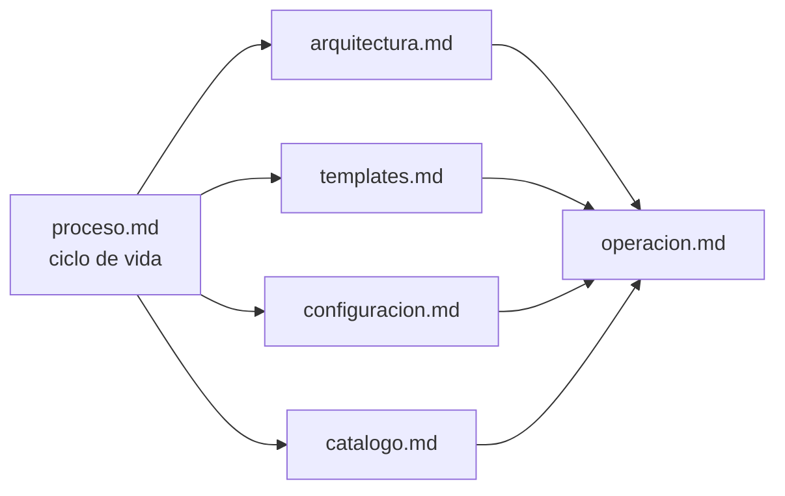
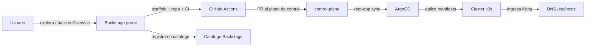

# Índice de documentación

Documentación técnica del portal Backstage del cluster y su proceso de entrega.

## Cómo leer esta documentación

Empieza por [`proceso.md`](proceso.md) (qué pasa de punta a punta), después
[`arquitectura.md`](arquitectura.md) (cómo está montado) y usa
[`configuracion.md`](configuracion.md) / [`templates.md`](templates.md) / [`catalogo.md`](catalogo.md)
como referencia de configuración. [`operacion.md`](operacion.md) es la guía de
operaciones y debug.

## Mapa de la documentación

## Repositorios correlacionados

| Repo | Rol | Documentación |
|---|---|---|
| [`backstage-gitops`](https://github.com/gusLopezC-DevOps/backstage-gitops) | Infraestructura del portal: manifests, CM de templates/plugins/config | este `docs/` |
| [`control-plane`](https://github.com/gusLopezC-DevOps/control-plane) | Plano de control GitOps (App-of-Apps) + gancho de alta de workloads | `docs/integracion-backstage.md`, `docs/operar.md`, `docs/arquetipos.md` |
| [`backstage-workloads`](https://github.com/gusLopezC-DevOps/backstage-workloads) | Entidades estáticas de catálogo (Systems/Resources) | `README.md` |
| `go-frontend-test` | Workload de ejemplo generado desde el template `go-frontend` | `README.md` |

## Flujo global (resumen)

## Nomenclatura

- **Workload** = unidad de despliegue y propiedad: 1 namespace + 1 AppProject + 1 Application + 1 source.
- **Template** = plantilla de scaffolder dentro de Backstage.
- **CM** = ConfigMap `backstage-templates`.
- **Arquetipos**: `stateless`, `stateful`, `job/cron`, `servicio-compartido` (ver control-plane `docs/arquetipos.md`).

## Seguridad

- **Nunca Versionar secretos**: los tokens se inyectan vía Secret del cluster
  (`backstage-secrets`, `postgres-sealed`) y SealedSecrets.
- En esta documentación los tokens aparecen como placeholder `${GITHUB_TOKEN}`.
- Los workloads se crean públicos por diseño (sin secretos en los repos).