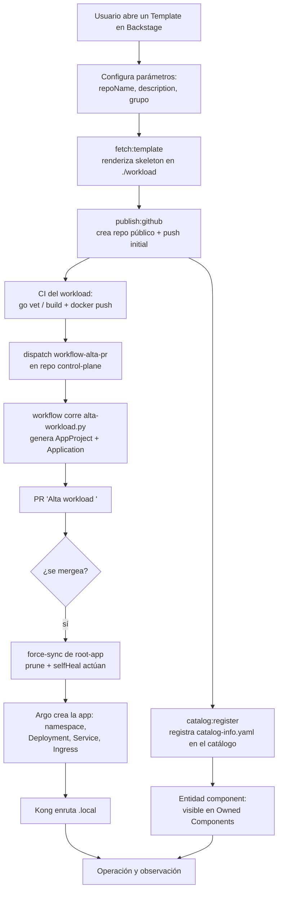
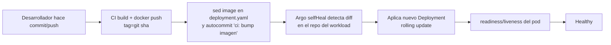
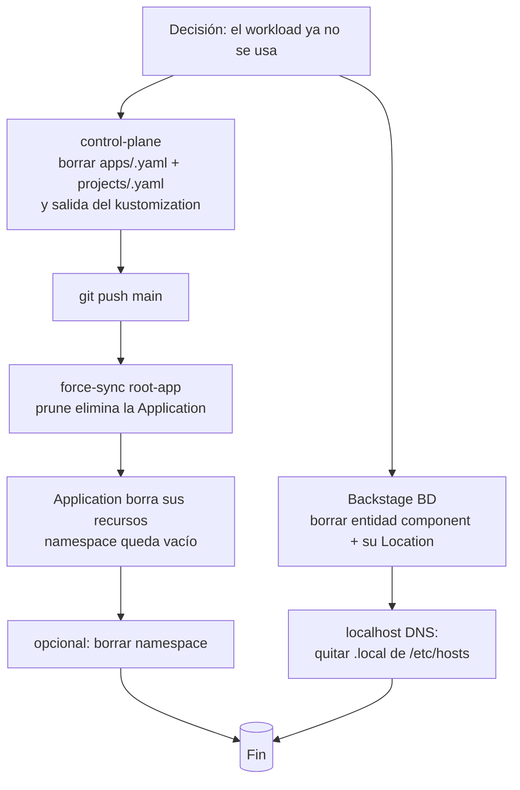

# Ciclo de vida completo de un workload

Este documento describe el **proceso total**: desde que un desarrollador crea un
workload en Backstage (o lo registra) hasta que corre en el cluster con su ingress,
y cómo se actualiza y se da de baja. Es el mapa de referencia del resto de la
documentación.

   Backstage
   GitHub
   ArgoCD
   Kubernetes
   Kong
   Docker

## 1) Alta (provisión) — etapas

### Detalle por etapa

| Etapa | Dónde | Quién/Qué | Detalles |
|---|---|---|---|
| **1. Formulario** | Backstage UI | Usuario | Inputs definidos en `template.yaml`: `repoName`, `description`, `grupo` (default `development`). |
| **2. Scaffold** | Backstage scaffolder | `fetch:template` | Renderiza `assets/templates/<t>/skeleton` → `./workload` con los valores del formulario. |
| **3. Publicación** | GitHub API | `publish:github` | Crea repo **público** en `gusLopezC-DevOps`, rama `main`, commit inicial; `repoVisibility: public` porque los secretos de org no llegan a repos privados. |
| **4. CI** | GitHub Actions (repo nuevo) | `ci.yml` | `go vet`/build, build+docker push `docker.io/guslopezc/<nombre>:${{ github.sha }}`, y **autocomitea el bump de imagen** en `deployment.yaml` (dispara el sync de Argo del workload). |
| **5. Gancho de alta** | GitHub Actions (repo control-plane) | `workflow-alta-pr.yml` (dispatch) | Backstage dispara `github:actions:dispatch` con `nombre/repositorio/arquetipo/grupo`. El workflow ejecuta `scripts/alta-workload.py`. |
| **6. Generar manifests** | script `alta-workload.py` | Python | Renderiza `plantillas/app-project.yaml` + `plantillas/application.yaml` → `overlays/prod/{projects,apps}/<nombre>.yaml` y actualiza el `kustomization.yaml`. |
| **7. PR** | control-plane | workflow | PR `Alta workload <nombre>` (body en una línea). CI valida coherencia (`validar-coherencia.py` + `render.sh`). |
| **8. Merge + sync** | ArgoCD | `root-app` | Tras el merge, con `prune+selfHeal` (y un force-sync si se quiere acelerar) la app `root-app` aplica el nuevo Application + AppProject. |
| **9. Despliegue** | Cluster k3s | Application del workload | 1 namespace + Deployment + Service + Ingress `ingressClassName: kong`; descartando `catalog-info.yaml` del scope de Argo (`directory.exclude`). |
| **10. Ruteo** | Kong + DNS | Kong IngressClass + `/etc/hosts` | `<nombre>.local` → Kong → Service. Añadir en el `/etc/hosts` del cliente: `192.168.100.77 <nombre>.local`. |
| **11. Catálogo** | Backstage catalog | `catalog:register` | Registra la `catalog-info.yaml` vía **URL raw** (`raw.githubusercontent.com`). El owner por defecto es `group:default/development`. |

> ℹ️ Los pasos 5–10 los orquesta el propio Backstage; el usuario solo ve el repo
> y el PR abierto.

## 2) Evolución (bump de imagen y cambios)

El ciclo de actualización **no pasa por control-plane**: el repo del workload lleva
sus propios manifests, la Application de Argo lee ese repo (`path: .`, `recurse: true`,
`exclude: catalog-info.yaml`) con `automated.prune+selfHeal`, así que cualquier bump de
imagen se aplica solo.

### Cambio de owner en el catálogo

- Editar `catalog-info.yaml` del repo del workload, commit + push.
- La Location registrada (URL raw) refresca sola en el siguiente ciclo (~1–2 min).
- Regla práctica: `owner: group:default/<grupo>`, con `development` como grupo por defecto
  (debe existir como entidad `Group` en el catálogo, ver `catalogo.md`).

## 3) Baja (borrado)

Pasos reales ejecutados de baja (referencia `mi-api5`):

1. Borrar el **repo GitHub** del workload (o marcarlo obsoleto).
2. En `control-plane`: eliminar `overlays/prod/apps/<n>.yaml` y `projects/<n>.yaml`
   + referencias en `kustomization.yaml`; commit + push.
3. `force-sync` de `root-app` (prune) → se elimina la Application y sus recursos.
4. Borrar el namespace vacío y la línea de `/etc/hosts`.
5. En el catálogo: eliminar la entidad `component:<n>` y su Location (SQL sobre la
   BD de Backstage) — si la entidad viene de un fichero estático, quitar también la
   Location desde la configuración (ver `catalogo.md`).

## Repositorios implicados

| Etapa | Repo |
|---|---|
| Templates + portal | `backstage-gitops` (`assets/templates/*`) |
| Gancho de alta / App-of-Apps | `control-plane` |
| Manifests + CI del workload | repo del workload (ej. `go-frontend-test`) |
| Entidades estáticas | `backstage-workloads` |
| Catálogo | BD PostgreSQL de Backstage |

## Datos de referencia (cluster)

- Cluster: k3s single-node, IP `192.168.100.77`.
- Portal: `https://backstage.local` · Argo: `https://argocd.local`.
- Kong: IngressClass `kong`, servicio `kong-kong-proxy` (80/443).
- Namespace de plataforma Backstage: `workloads`.