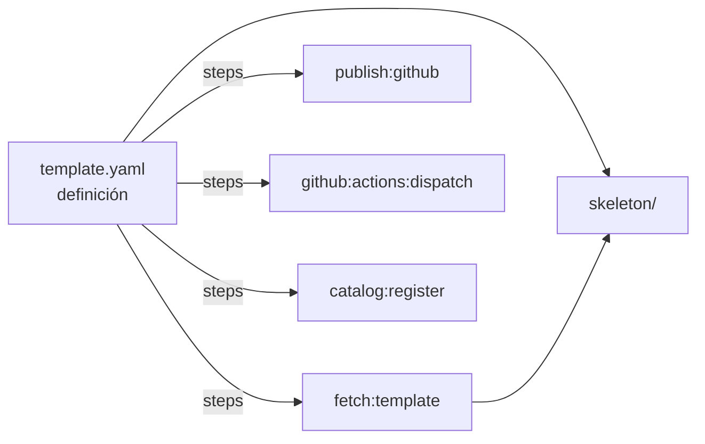
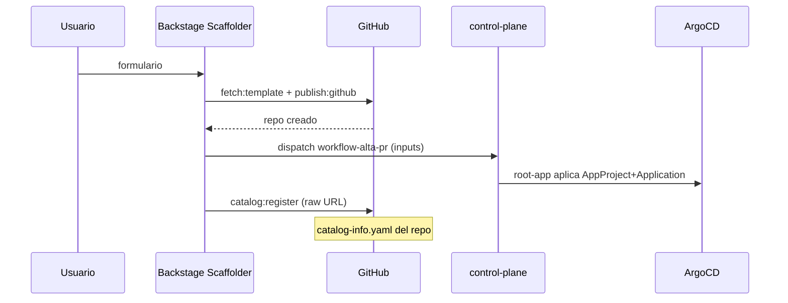

# Templates de software (scaffolder)

Cada template vive en `apps/backstage/assets/templates/<nombre>/` y consta de:

- `template.yaml` — definición `scaffolder.backstage.io/v1beta3` (inputs + steps).
- `skeleton/` — arbol plantilla que `fetch:template`/`fetch:plain` renderiza.

Los 3 templates están registrados en el catálogo vía `override.yaml`
(`catalog.locations` → `file:/app/templates/<t>/template.yaml`).



## Resumen

| Template | Kind | Tipo | Skeleton | Particularidades |
|---|---|---|---|---|
| `python-fastapi` | service | Python/FastAPI | `fastapi` app + Docker multi-stage + CI | paso extra `fs:delete` de residuos; puerto 8080 |
| `go-frontend` | service | Go `net/http` frontend | servidor estático (`public/`) + `/health`; Docker distroless + CI | port 8080 (usa `PORT` si existe) |
| `crossplane-local-deployment` | service | Crossplane `LocalDeployment` claim | claim + catalog-info | **no crea repo propio**: pushea a `backstage-workloads` |

## Parámetros (comunes a python y go)

| Parámetro | Tipo | Default | Uso |
|---|---|---|---|
| `repoName` | string | — | nombre del workload = repo + namespace + AppProject + Application |
| `description` | string | — | descripción (repo + catálogo) |
| `grupo` | string | `development` | owner del catálogo (`group:default/<grupo>`) |

> El default `development` debe coincidir con una entidad `Group` existente en el
> catálogo para que el relación de ownership resuelva en la UI (ver `catalogo.md`).

## Pasos del scaffold (python-fastapi / go-frontend)

1. **`fetch:template`** `./skeleton` → `./workload` con los valores del formulario.
2. **`limpiar`** (solo python): elimina residuos del skeleton.
3. **`publish:github`**: crea repo público `gusLopezC-DevOps/<repoName>`,
   `defaultBranch: main`, push inicial.
4. **`github:actions:dispatch`** sobre `control-plane` (workflow `workflow-alta-pr.yml`):
   `nombre`, `repositorio=https://github.com/gusLopezC-DevOps/<n>.git`,
   `grupo`, `arquetipo=stateless`. → genera AppProject + Application + PR.
5. **`catalog:register`**: registra
   `https://raw.githubusercontent.com/gusLopezC-DevOps/<n>/main/catalog-info.yaml`
   (URL **raw**, no `blob`/`tree`, para que el refresh del catálogo funcione).



## El skeleton de go-frontend

```
skeleton/
├── catalog-info.yaml           # type: website, owner group:default/${{values.grupo}}
├── deployment.yaml             # port 8080, image docker.io/guslopezc/<repo>:<sha>
├── service.yaml
├── ingress.yaml                # ingressClassName: kong, host <repo>.local
├── Dockerfile                  # multi-stage → distroless
├── go.mod                      # stdlib net/http
├── main.go                     # sirve public/ + /health en PORT (8080)
├── mkdocs.yml + README.md      # techdocs
├── public/index.html
└── .github/workflows/ci.yml    # vet+build, docker push tag sha, bump imagen
```

## El skeleton de python-fastapi

```
skeleton/
├── app/main.py                 # FastAPI (health + raíz)
├── app/requirements.txt
├── Dockerfile                  # multi-stage
├── catalog-info.yaml           # type: service, owner group
├── deployment.yaml / service.yaml / ingress.yaml (kong, ecosistema 8080)
├── mkdocs.yml / README.md
└── .github/workflows/ci.yml    # build+push+bump imagen
```

## El template crossplane (k8s-manifests)

- `crossplane-skeleton/` = `catalog-info.yaml` + `claim.yaml` + `kustomization.yaml`
  (un `LocalDeployment`, labels `backstage.io/kubernetes-id`, hostname `<app>.local`).
- Paso `gitops:push-to-repo` (custom action del `plugins/custom-actions.cjs.js`)
  escribe el claim en `backstage-workloads/apps/workloads/<appName>/` y commitea.
- `catalog:register` usa `repoContentsUrl` + `catalogInfoPath` (blob) — por eso el
  refresh de **esta** entidad usa la variante `blob`, distinta de la raw de los otros dos.

> Requisito de **crossplane**: la composición `XLocalDeployment` (en este repo,
> `composition.yaml`) debe estar desplegada y funcional para que el claim se materialice.

## Cómo añadir/editar un template

1. Editar/crear `assets/templates/<t>/template.yaml` (y skeleton).
2. Regenerar el CM: `python3 /tmp/opencode/gen_cm.py /tmp/backstage-gitops`.
3. Añadir la location en `assets/override.yaml` → `catalog.locations` (`file` +
   `allow: [Template]`).
4. Commit + push + sync Argo + `rollout restart deploy/backstage`.
5. Verificar en la UI que aparece en **Create…**.

> La integración GitHub de Backstage usa el token `${GITHUB_TOKEN}` (deployment env)
> para acciones sobre repos y raw.